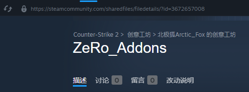
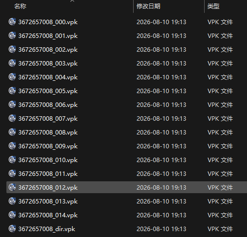
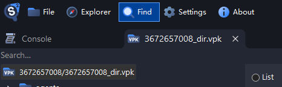
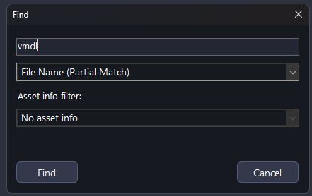
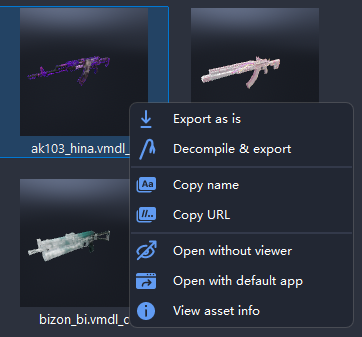
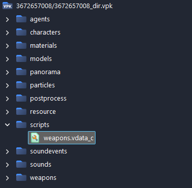
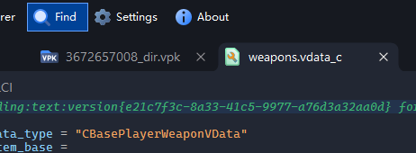

# CS2-WeaponModelChanger
### 此插件是在插件[equipments](https://github.com/exkludera-cssharp/equipments)基础上进行修改  
属于Equipments的精简修复版
移除了对[Clientprefs](https://github.com/Cruze03/Clientprefs)的依赖  
修复了更换模型后无法还原的BUG  
修复了修改后重进失效的BUG  
修复了选择后模型末尾出现menu的BUG  
___
### 插件的依赖
[MetaMod](https://www.sourcemm.net/downloads.php?branch=dev)  
[CounterStrikeSharp](https://github.com/roflmuffin/CounterStrikeSharp)  
[MultiAddonManager](https://github.com/Source2ZE/MultiAddonManager)  
[CS2MenuManager](https://github.com/schwarper/CS2MenuManager)  
___
### 使用方法
## 准备工作  
下载创意工坊资源包  
下载[Source 2 Viewer](https://s2v.app)  
找到创意工坊资源包目录，以下图为例  
  
其中3672657008是创意工坊id，找到steam安装目录steamapps/workshop/content/730/创意工坊id
## 具体步骤
使用Source 2 Viewer打开创意工坊资源包(任意以.vpk结尾的文件)  
  
打开之后点击上方find  
  
查询vmdl  
  
右键点击需要添加的武器模型，选择Copy name  
  
打开scripts/weapons.vdata_c  
  
再次点击find  
  
