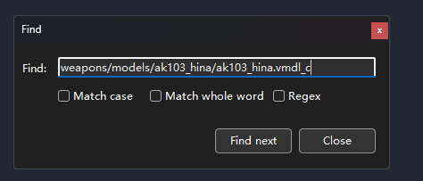
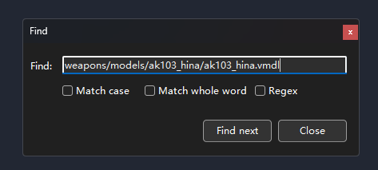
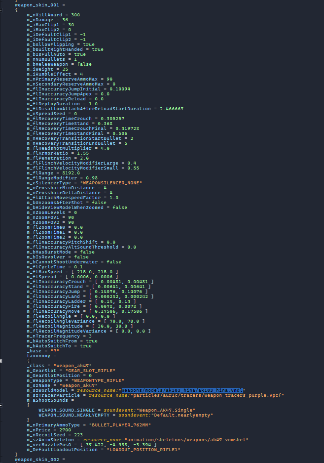
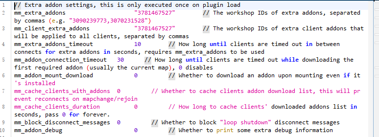

# CS2-WeaponModelChanger
### 插件简介
CS2-WeaponModelChanger 是一个基于 [equipments](https://github.com/exkludera-cssharp/equipments) 插件的精简修复版，专门用于 Counter-Strike 2 (CS2) 服务器的武器模型替换。

**主要特点与修复**：
- 🚫 **移除依赖**：不再需要 [Clientprefs](https://github.com/Cruze03/Clientprefs) 插件
- 🐛 **Bug修复**：修复了更换模型后无法还原、修改后重进失效、模型名称末尾出现 "menu" 等问题
- ⚙️ **精简优化**：在保留核心功能的前提下优化了代码结构和性能

**功能说明**：
此插件允许玩家通过菜单或指令选择不同的武器模型（皮肤），并支持权限和队伍限制。模型替换基于服务端配置，无需客户端安装任何文件。

**⚠️ 重要提示**：
- 本插件仅供学习和测试使用。
- 使用任何修改游戏文件的插件都可能存在一定的VAC封禁风险，请在非正式环境中谨慎使用。
- 作者不对使用本插件造成的任何后果负责。
___
### 插件依赖
以下插件是运行本插件所必需的，请确保在安装本插件前已正确安装并配置它们。

| 依赖项 | 最低版本要求 | 安装指南 | 说明 |
| :--- | :--- | :--- | :--- |
| **[MetaMod](https://www.sourcemm.net/downloads.php?branch=dev)** | 最新开发版 | [官方安装文档](https://wiki.alliedmods.net/Installing_Metamod:Source) | 服务器插件基础框架 |
| **[CounterStrikeSharp](https://github.com/roflmuffin/CounterStrikeSharp)** | 最新版 | [官方安装文档](https://github.com/roflmuffin/CounterStrikeSharp#installation) | CS2 的 C# 插件核心 |
| **[MultiAddonManager](https://github.com/Source2ZE/MultiAddonManager)** | 最新版 | [项目Readme](https://github.com/Source2ZE/MultiAddonManager) | 管理服务器创意工坊资源包 |
| **[CS2MenuManager](https://github.com/schwarper/CS2MenuManager)** | 最新版 | [项目Readme](https://github.com/schwarper/CS2MenuManager) | 提供菜单系统支持 |

> 💡 **安装提示**：通常，你需要将这些依赖插件放入服务器的 `addons/` 或 `addons/counterstrikesharp/plugins/` 目录下，并确保它们在服务器启动时被加载。具体请参照各依赖项的官方文档。
___
## 使用方法
### 准备工作  
下载创意工坊资源包  
下载[Source 2 Viewer](https://s2v.app)  
找到创意工坊资源包目录，以下图为例  
  
其中3672657008是创意工坊id，找到steam安装目录steamapps/workshop/content/730/创意工坊id
### 具体步骤
使用Source 2 Viewer打开创意工坊资源包(任意以.vpk结尾的文件)  
  
打开之后点击上方find  
  
查询vmdl  
  
右键点击需要添加的武器模型，选择Copy name  
  
打开scripts/weapons.vdata_c  
  
再次点击find  
  
输入刚才复制文件name  
  
删掉结尾的_c  
  
找到武器名称并复制(weapon_skin_001)  
  
打开服务端MultiAddonManager的配置文件，路径在game/csgo/cfg/multiaddonmanager/multiaddonmanager.cfg  
修改mm_extra_addons和mm_client_extra_addons为创意工坊id  
  
在启动CS2服务器后，输入mm_download_addon 创意工坊id 下载资源包  
### 配置文件编辑
```
{
  // 聊天消息前缀
  // 支持颜色代码，例如: {white}, {darkred}, {green}, {lightblue} 等
  "Prefix": "{orange}[SkinChanger]{default}",
  // 主菜单设置
  "Menu": {
    // 菜单类型
    // "CenterHtmlMenu" - 屏幕中间的 HTML 菜单 (推荐)
    // "ChatMenu" - 聊天框内的文本菜单
    "Type": "CenterHtmlMenu",
    // 打开主菜单的指令列表
    // 玩家在控制台或聊天框输入!cw 就能打开
    "Command": [ "css_cw" ],
    // 打开主菜单所需的权限
    // 留空 [] 表示所有人都可以打开
    // 示例: ["@css/generic"] 表示需要通用管理员权限
    "Permission": [],
    // 限制使用菜单的队伍
    // "" - 无限制
    // "t" 或 "terrorist" - 仅T
    // "ct" 或 "counterterrorist" - 仅CT
    "Team": ""
  },
  // 分类配置
  // 您可以创建多个分类，例如 "Knives", "Gloves", "Rifles"
  "Categories": {
    // 分类名称 (Key)，自定义即可，例如这里叫 "Weapons"
    "Weapons": {
      // 直接打开此特定分类的指令
      // 配置后，玩家输入指令直接看到的是该分类下的皮肤，而不是主菜单
      "Command": [ "css_weapons" ],
      // 是否允许同时装备多个该分类下的皮肤
      "AllowMultiple": true,
      // 使用此分类下任何皮肤的权限要求
      "Permission": [],
      // 限制使用此分类的队伍
      "Team": "",
      // 皮肤/装备列表
      "Equipment": [
        {
          // 在菜单中显示的名称
          "Name": "蓝色皮肤 AK47",
          // 使用该特定皮肤的权限
          // 会与分类权限叠加检查
          "Permission": [],
          // 限制该皮肤使用的队伍
          "Team": "",
          // 核心配置：武器定义
          // 格式必须为： "基准武器名:目标模型名"
          // 
          // 1. 基准武器名 (冒号左边):
          //    用于检测玩家当前持有的武器。必须与游戏内部识别的武器名称一致。
          //    例如: weapon_ak47, weapon_knife, weapon_m4a1
          //
          // 2. 目标模型名 (冒号右边):
          //    用于替换模型，例如具体步骤里复制的weapon_skin_001
          "Weapon": "weapon_ak47:weapon_ak47_blue"
        },
        {
          "Name": "红色皮肤 AK47",
          "Permission": [ "@css/vip" ], // 例子：仅VIP可用
          "Team": "t",                  // 例子：仅T可用
          "Weapon": "weapon_ak47:weapon_ak47_red"
        }
      ]
    }
  }
}
```
